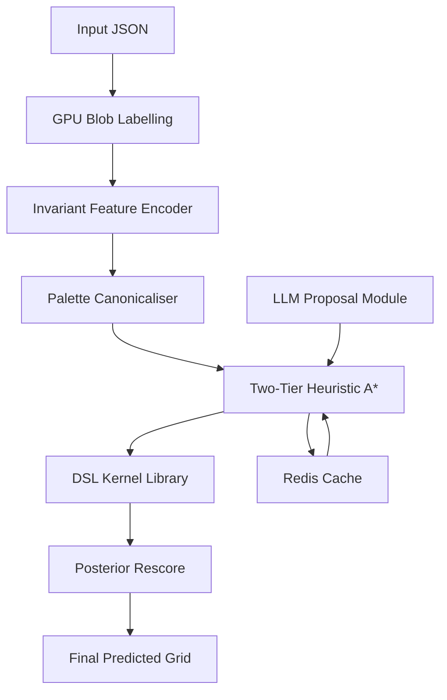
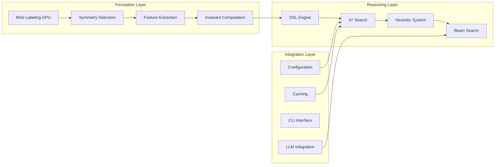

# Design Document

## Overview

The ARC-AGI Solver implements a novel two-stage architecture that separates visual perception from symbolic reasoning. The system transforms raw pixel grids into rich mathematical feature representations, then applies constrained search over a domain-specific language to discover transformation rules. This design leverages GPU acceleration for perception tasks and sophisticated heuristics for efficient search space exploration.

The architecture follows a clear separation of concerns:
- **Perception Layer**: Converts visual data to symbolic mathematical features
- **Reasoning Layer**: Applies search algorithms over a constrained DSL
- **Integration Layer**: Provides caching, configuration, and user interfaces

## Architecture

### High-Level System Flow



### Core Components Architecture



## Components and Interfaces

### 1. Perception Layer Components

#### GPU Blob Labeling Engine
- **Purpose**: Fast connected component analysis using CUDA union-find
- **Input**: Raw grid arrays (np.int32)
- **Output**: Labeled blob arrays with unique IDs
- **Performance**: ≤2ms per 30×30 grid
- **Implementation**: CUDA kernels with CPU fallback

```python
class BlobLabeler:
    def label_components(self, grid: np.ndarray) -> np.ndarray:
        """GPU-accelerated connected component labeling"""
        pass
    
    def extract_blobs(self, labeled_grid: np.ndarray) -> List[Blob]:
        """Extract individual blob objects with metadata"""
        pass
```

#### Invariant Feature Extractor
- **Purpose**: Compute mathematical invariants for each blob
- **Features Computed**:
  - Orbit signature σ(S): Symmetry fingerprint under D₄ group
  - Spectral triple: λ₂, λ₃, λ₄ Laplacian eigenvalues  
  - Persistent homology: 32-length landscape vectors
  - Zernike moments: Complex moment invariants up to order 4
- **Output**: 50-dimensional feature vector per blob

```python
@dataclass
class FeatureVector:
    orbit_signature: np.ndarray  # D4 symmetry fingerprint
    spectral_features: np.ndarray  # Laplacian eigenvalues
    persistence_landscape: np.ndarray  # Topological features
    zernike_moments: np.ndarray  # Shape descriptors
    
    def to_array(self) -> np.ndarray:
        """Concatenate to 50-dim vector"""
        pass
```

#### Symmetry Detection System
- **Purpose**: Fast symmetry analysis using bitboard operations
- **Method**: Store each color as 10 uint64 bitmasks for efficient transforms
- **Operations**: 8-way symmetry testing (4 rotations + 4 reflections)
- **Performance**: ≤10µs per grid

### 2. Reasoning Layer Components

#### Domain-Specific Language Engine
- **Core Primitives**:
  - Geometric: `Rotate90`, `Rotate180`, `ReflectH`, `ReflectV`
  - Spatial: `Crop(r1,r2,c1,c2)`, `Paint(x,y,c)`
  - Color: `MapColors(perm[10])`
  - Conditional: `PaintIf(predicate, action)`
- **Constraints**: Maximum program length K=4
- **Implementation**: C++ kernels with Python bindings via pybind11

```python
class DSLEngine:
    def execute_program(self, grid: np.ndarray, program: List[str]) -> np.ndarray:
        """Execute DSL program on input grid"""
        pass
    
    def validate_program(self, program: List[str]) -> bool:
        """Validate program syntax and constraints"""
        pass
```

#### Two-Tier Heuristic System
- **Tier 1**: L₂ spectral-homology distance
  - Formula: `h₁(G) = min_{ρ∈D₄} ||f̄_in - f̄_ρ(G)||₂`
  - Fast computation using precomputed feature vectors
- **Tier 2**: Hungarian assignment fallback
  - Solves optimal blob matching problem
  - Provides tighter bounds when Tier 1 insufficient
- **Admissibility**: Proven lower bounds guarantee A* optimality

```python
class HeuristicSystem:
    def compute_tier1_heuristic(self, current_state: GridState, target_features: FeatureVector) -> float:
        """Fast L2 distance heuristic"""
        pass
    
    def compute_tier2_heuristic(self, current_state: GridState, target_state: GridState) -> float:
        """Hungarian assignment heuristic"""
        pass
```

#### A* Search Engine
- **Algorithm**: Admissible A* with beam search pruning
- **State Representation**: Grid + program sequence
- **Cost Function**: Program length (uniform cost)
- **Pruning**: Beam width adaptive based on heuristic quality
- **Target**: ≤600 expanded states per puzzle average

### 3. Integration Layer Components

#### Configuration Management
- **Framework**: Hydra for hierarchical configuration
- **Features**: Runtime parameter override, experiment tracking
- **File**: `conf/config.yaml` with nested parameter groups

#### Caching System
- **Backend**: Redis for persistent caching
- **Key Strategy**: SHA-1 hash of canonical grid representation
- **Value**: Successful DSL program strings
- **Performance**: 10% hit rate target on development split

#### LLM Integration Module (Optional)
- **Model**: Qwen-32B-Instruct with 4-bit quantization
- **Method**: Soft-prompt tuning on 256 tokens
- **Training**: 300 synthetic grid→DSL sequence pairs
- **Output**: Top-3 candidate programs with 95% parseability
- **Integration**: Feeds proposals into beam search as high-priority candidates

```python
class LLMProposer:
    def generate_proposals(self, structured_description: str) -> List[str]:
        """Generate DSL program candidates from feature description"""
        pass
    
    def validate_proposals(self, proposals: List[str]) -> List[str]:
        """Filter valid, parseable programs"""
        pass
```

## Data Models

### Core Data Structures

```python
@dataclass
class Blob:
    id: int
    color: int
    pixels: List[Tuple[int, int]]
    bounding_box: Tuple[int, int, int, int]
    center_of_mass: Tuple[float, float]
    area: int
    holes: int
    features: FeatureVector

@dataclass
class GridState:
    grid: np.ndarray
    blobs: List[Blob]
    program: List[str]
    cost: float
    heuristic: float
    
    def total_cost(self) -> float:
        return self.cost + self.heuristic

@dataclass
class SearchNode:
    state: GridState
    parent: Optional['SearchNode']
    action: str
    depth: int
```

### Pipeline Data Flow

1. **Input**: JSON task with train/test grid pairs
2. **Canonicalization**: Color palette normalization, caching
3. **Perception**: Blob extraction → feature computation → 50-dim vectors
4. **Search**: A* over DSL space with heuristic guidance
5. **Output**: Predicted grid + program trace

## Error Handling

### Failure Modes and Recovery

1. **GPU Memory Exhaustion**
   - Fallback: CPU-based blob labeling
   - Graceful degradation with performance warning

2. **Search Timeout**
   - Hard timeout: 30 seconds per puzzle
   - Partial results: Return best candidate found
   - Logging: Save search statistics for analysis

3. **LLM Integration Failures**
   - Parsing errors: Fallback to vanilla A* search
   - Model unavailable: Disable LLM proposals, continue with heuristics
   - Invalid proposals: Schema validation with rejection

4. **Feature Computation Errors**
   - Numerical instability: Regularization and fallback methods
   - Topology errors: Skip persistent homology, use remaining features
   - Eigenvalue failures: Use backup spectral methods

### Error Recovery Strategies

```python
class ErrorHandler:
    def handle_gpu_failure(self) -> None:
        """Switch to CPU fallback mode"""
        pass
    
    def handle_search_timeout(self, partial_results: List[GridState]) -> GridState:
        """Return best partial result"""
        pass
    
    def handle_feature_error(self, blob: Blob, error: Exception) -> FeatureVector:
        """Compute fallback features"""
        pass
```

## Testing Strategy

### Unit Testing Framework

1. **Perception Layer Tests**
   - Blob labeling correctness on synthetic grids
   - Feature invariance under known transformations
   - Performance benchmarks for GPU operations
   - Symmetry detection accuracy

2. **Reasoning Layer Tests**
   - DSL primitive correctness
   - A* optimality on toy problems
   - Heuristic admissibility verification
   - Search termination guarantees

3. **Integration Tests**
   - End-to-end pipeline on sample tasks
   - Configuration loading and override
   - Cache consistency and performance
   - CLI interface functionality

### Performance Testing

```python
class PerformanceTests:
    def test_blob_labeling_speed(self):
        """Verify ≤2ms GPU labeling"""
        pass
    
    def test_feature_extraction_speed(self):
        """Verify ≤0.2ms per blob"""
        pass
    
    def test_search_efficiency(self):
        """Verify ≤600 expanded states average"""
        pass
    
    def test_end_to_end_runtime(self):
        """Verify ≤0.5s median runtime"""
        pass
```

### Validation Testing

1. **Mathematical Correctness**
   - Invariant property verification
   - Numerical stability tests
   - Symmetry preservation checks

2. **Accuracy Benchmarks**
   - Development split: Continuous validation
   - Ablation studies: Component contribution analysis
   - Regression tests: Performance maintenance

### Test Data Strategy

- **Synthetic Grids**: Controlled test cases with known properties
- **ARC Development Split**: Real puzzle validation
- **Edge Cases**: Boundary conditions, degenerate inputs
- **Performance Stress Tests**: Large grids, complex patterns