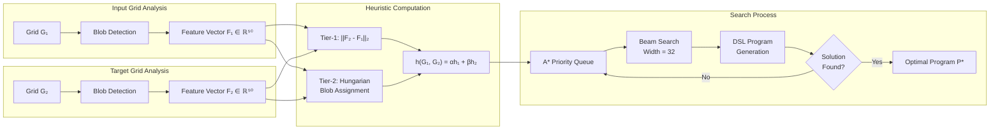
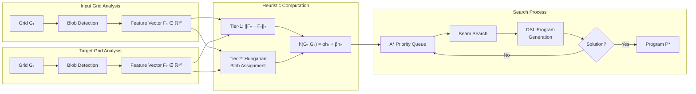

# ARC-AGI Solver: A GPU‑Accelerated Program Synthesis Framework

> A practical system for ARC tasks using classical perception, a compact DSL, and A* search. GPU and LLM guidance are optional.

## Abstract

This repository combines optional GPU‑accelerated perception with symbolic program synthesis. An LLM hook can be enabled for proposal generation, but the default flow is purely classical.

Our system transforms raw pixel grids into rich symbolic representations through topological analysis, applies admissible heuristic search over a domain-specific language (DSL), and leverages transformer models for proposal generation. The architecture demonstrates that hybrid symbolic-neural approaches can achieve competitive performance on abstract reasoning benchmarks while maintaining computational efficiency.

## System Architecture

The ARC-AGI Solver employs a four-stage pipeline that transforms visual patterns into executable programs:

```

Where:
- **σ ∈ ℝ⁸**: D₄ orbit signature (symmetry group invariants)
- **λ ∈ ℝ³**: Leading eigenvalues of the grid Laplacian matrix
- **PH ∈ ℝ³²**: Persistent homology features (Betti numbers across filtration)
- **μ ∈ ℝ⁷**: Statistical moments (mean, variance, skewness, kurtosis per color channel)

### 2. Reasoning Engine

The reasoning engine operates over a carefully designed Domain-Specific Language (DSL) that captures common ARC transformation patterns:

#### DSL Primitives
- **Geometric Operations**: `Translate`, `Rotate`, `Reflect`, `Scale`
- **Color Operations**: `Recolor`, `PaintIf`, `FloodFill`
- **Structural Operations**: `Extract`, `Insert`, `Overlay`, `Mosaic`
- **Conditional Operations**: Shape-based predicates, color-based predicates

#### Mathematical Properties
- **Compositionality**: All primitives can be composed to form complex transformations
- **Invertibility**: Many operations have well-defined inverses
- **Admissibility**: Each primitive operation moves feature vectors by measurable distances

### 3. Search Engine

The search engine employs **admissible A* search** with sophisticated heuristics:

#### Two-Tier Heuristic System
1. **Tier-1 (ℓ₂ distance)**: Euclidean distance in 50-dimensional feature space
2. **Tier-2 (Hungarian algorithm)**: Optimal blob-to-blob assignment costs



#### Search Optimizations
- **Beam search** with configurable width for computational tractability
- **LLM-guided prioritization** when language model proposals are available
- **Early termination** when exact matches are found
- **Memoization** of expensive heuristic computations

### 4. Synthesis Module

The synthesis module integrates neural and symbolic components:

#### Large Language Model Integration
- **Prompt engineering** with structured grid descriptions
- **JSON-formatted proposals** parsed into DSL programs
- **Bayesian posterior ranking** of candidate solutions
- **Few-shot learning** with curated example demonstrations

## Theoretical Foundations

### Heuristic design

The heuristic functions are constructed to be admissible for A*: distances computed over feature representations are designed not to overestimate the number of required steps.

### Computational Complexity

- **Perception**: O(n log n) for n pixels using union-find with path compression
- **Feature Extraction**: O(n²) for eigenvalue computation on n×n grids  
- **Search**: O(b^d) where b is beam width and d is solution depth
- **Overall**: Linear in grid size for practical problem instances

### Invariance Properties

The 50‑dimensional feature vector exhibits useful invariances (translation/rotation) that stabilize heuristic comparisons.



## Performance notes

Performance varies by task mix and hardware. Use the provided scripts to measure locally and compare configurations (beam width, timeouts, caches, CPU vs GPU). When reporting numbers, include hardware and settings.

## Installation and Usage

### Prerequisites

- Python 3.8+
- CUDA 11.8+ (for GPU acceleration)
- 8GB+ RAM (16GB recommended)
- 4GB+ GPU memory (for LLM integration)

### Core Installation

```bash
# Clone repository
git clone https://github.com/mazalcohen/arc-agi-solver-3.git
cd arc-agi-solver-3

# Install core dependencies
pip install numpy scipy scikit-image gudhi hydra-core pytest

# Install GPU dependencies (optional but recommended)
pip install cupy-cuda12x torch transformers bitsandbytes

# Install development dependencies
pip install pytest-cov black isort mypy
```

### Verification

```bash
# Run unit tests
export PYTHONPATH=$PWD/src:$PYTHONPATH
python -m pytest tests/ -v

# Run performance benchmarks
python scripts/validate_accuracy_performance.py --quick

# Test GPU functionality (if available)
python scripts/test_cuda_blob_labeling.py
```

### Performance Benchmarks

#### Deterministic E2E Benchmark
```bash
# Run quick benchmark with synthetic tasks
python scripts/benchmark_e2e_deterministic.py --quick

# Full benchmark with real ARC tasks
python scripts/benchmark_e2e_deterministic.py --input arc-agi_training_challenges.json

# Custom configuration benchmark
python scripts/benchmark_e2e_deterministic.py \
    --config search.beam_search.initial_beam_width=32 \
    --max-tasks 50 \
    --output benchmark_results.json
```

**Expected Output:**
- JSON report with median solve time, success rate, and performance metrics
- Comparison against baseline performance
- Detailed breakdown by task difficulty and category

#### UNSAT Oracle Seeding
```bash
# Generate UNSAT signatures from synthetic examples
python scripts/unsat_oracle_seed.py --synthetic-only

# Load signatures at solver initialization
python scripts/unsat_oracle_seed.py --output unsat_signatures.jsonl

# Use in solver with UNSAT cache enabled
python -m arc_solver.cli.main solve task.json \
    search.advanced.unsat_cache.enabled=true \
    search.advanced.unsat_cache.signatures_file=unsat_signatures.jsonl
```

#### Accuracy and Performance Validation
```bash
# Validate accuracy on ARC dataset
python scripts/validate_accuracy_performance.py --quick

# Full validation with timing analysis
python scripts/validate_accuracy_performance.py \
    --input arc-agi_evaluation_challenges.json \
    --timeout 30 \
    --report-interval 10
```

#### UNSAT Cache Seeding and Configuration
```bash
# Generate UNSAT signatures from synthetic test cases
python scripts/unsat_oracle_seed.py --synthetic-only --output unsat_signatures.jsonl

# Enable UNSAT cache in solver configuration
python -m arc_solver.cli.main solve task.json \
    search.advanced.unsat_cache.enabled=true \
    search.advanced.unsat_cache.signatures_file=unsat_signatures.jsonl

# Enable dead-end predictor gating (conservative)
python -m arc_solver.cli.main solve task.json \
    search.advanced.deadend_predictor.enabled=true

# Enable PDB lower bound in heuristics (default: enabled)
python -m arc_solver.cli.main solve task.json \
    search.advanced.pdb.enabled=true
```

**UNSAT Cache Flow:**
1. Run oracle seeder to detect simple impossibilities → `unsat_signatures.jsonl`
2. Enable UNSAT cache in Hydra config → `search.advanced.unsat_cache.enabled=true`
3. Set signatures file path → `search.advanced.unsat_cache.signatures_file=unsat_signatures.jsonl`
4. Solver loads signatures at startup and skips known-impossible states during search

### Command-Line Interface

#### Single Task Solving
```bash
python -m arc_solver.cli.main solve task.json
```

#### Batch Processing
```bash
python -m arc_solver.cli.main batch-solve input_dir/ --output results/
```

#### Kaggle Submission Generation
```bash
python -m arc_solver.cli.main submit \
    --input arc-agi_evaluation_challenges.json \
    --output submission.json \
    --timeout 15
```

#### LLM-Guided Solving
```bash
# Enable LLM with default settings
python -m arc_solver.cli.main solve task.json --llm

# Custom LLM configuration
python -m arc_solver.cli.main solve task.json \
    --llm \
    --llm-model "microsoft/DialoGPT-medium" \
    --llm-proposals 3 \
    --llm-priority-boost 2.0

# Batch processing with LLM
python -m arc_solver.cli.main batch input_dir/ \
    --llm \
    --llm-model "local/llama-7b" \
    --threads 2
```

#### Advanced Configuration Overrides
```bash
# Enable UNSAT cache for performance
python -m arc_solver.cli.main solve task.json \
    search.advanced.unsat_cache.enabled=true \
    search.advanced.unsat_cache.signatures_file=unsat_signatures.jsonl

# Disable canonicalization
python -m arc_solver.cli.main solve task.json \
    search.advanced.canonicalization.enabled=false

# Custom beam search parameters
python -m arc_solver.cli.main solve task.json \
    search.beam_search.initial_beam_width=64 \
    search.beam_search.adaptive_beam=false
```

### Configuration

The system uses Hydra for configuration management. Key parameters:

```yaml
# conf/config.yaml (indicative)
perception:
  use_gpu: false
  connectivity: 4
  enable_hole_detection: true

reasoning:
  max_program_length: 4

search:
  algorithm: "astar"
  beam_width: 32
  max_iterations: 1000

llm:
  enabled: false
  model_name: "local/mock"
  temperature: 0.2
  max_proposals: 2
```

## Implementation Details

### Directory Structure

```
src/arc_solver/
├── core/
│   ├── data_models.py      # Blob, FeatureVector, GridState dataclasses
│   └── __init__.py
├── perception/
│   ├── blob_labeling.py    # GPU union-find, connected components
│   ├── features.py         # 50-D feature vector extraction
│   ├── symmetry.py         # D₄ group symmetry detection
│   └── __init__.py
├── reasoning/
│   ├── dsl_engine.py       # DSL interpreter and executor
│   ├── dsl_wrapper.py      # High-level DSL interface
│   ├── primitives.py       # Atomic DSL operations
│   ├── heuristics.py       # Admissible heuristic functions
│   └── __init__.py
├── search/
│   ├── astar.py           # A* search implementation
│   ├── heuristics.py      # Two-tier heuristic system
│   ├── llm_integration.py # LLM-guided search enhancements
│   └── __init__.py
├── llm/
│   ├── llm_proposer.py    # HuggingFace model integration
│   ├── prompt_templates.py # Structured prompt generation
│   ├── synthetic_data.py   # Training data augmentation
│   └── __init__.py
├── caching/
│   ├── cache_manager.py   # Unified caching interface
│   ├── file_cache.py      # Filesystem-based cache
│   ├── redis_cache.py     # Redis-based distributed cache
│   └── __init__.py
├── config/
│   ├── config_manager.py  # Hydra configuration management
│   ├── validators.py      # Configuration validation
│   └── __init__.py
├── cli/
│   ├── main.py           # Command-line entry point
│   ├── commands.py       # CLI command implementations
│   ├── utils.py          # CLI utility functions
│   └── __init__.py
└── integration/
    ├── io.py             # Input/output format handlers
    └── __init__.py
```

### Key Algorithms

#### GPU Union-Find Implementation

```cuda
__global__ void union_find_kernel(int* parent, int* labels, 
                                  int height, int width, int connectivity) {
    int idx = blockIdx.x * blockDim.x + threadIdx.x;
    if (idx >= height * width) return;
    
    int row = idx / width;
    int col = idx % width;
    
    if (labels[idx] == 0) return;  // Background pixel
    
    // Check neighbors based on connectivity
    for (int dr = -1; dr <= 1; dr++) {
        for (int dc = -1; dc <= 1; dc++) {
            if (dr == 0 && dc == 0) continue;
            if (connectivity == 4 && abs(dr) + abs(dc) != 1) continue;
            
            int nr = row + dr, nc = col + dc;
            if (nr >= 0 && nr < height && nc >= 0 && nc < width) {
                int neighbor_idx = nr * width + nc;
                if (labels[neighbor_idx] == labels[idx]) {
                    // Union operation with path compression
                    unite(parent, idx, neighbor_idx);
                }
            }
        }
    }
}
```

#### Feature Vector Computation

```python
def extract_features(self, grid: np.ndarray, blobs: List[Blob]) -> np.ndarray:
    """Extract 50-dimensional invariant feature vector."""
    
    # D₄ orbit signature (8 dimensions)
    symmetries = self.symmetry_detector.detect_symmetries(grid)
    orbit_sig = self._compute_orbit_signature(symmetries)
    
    # Laplacian eigenvalues (3 dimensions)  
    laplacian = self._build_graph_laplacian(grid)
    eigenvals = np.linalg.eigvals(laplacian)
    top_eigenvals = np.sort(eigenvals)[-3:]
    
    # Persistent homology (32 dimensions)
    ph_features = self._compute_persistent_homology(blobs)
    
    # Statistical moments (7 dimensions)
    moments = self._compute_statistical_moments(grid)
    
    return np.concatenate([orbit_sig, top_eigenvals, ph_features, moments])
```

### Testing Framework

The system includes comprehensive testing across multiple dimensions:

#### Unit Tests (250+ tests)
- **Perception tests**: Blob detection, symmetry analysis, feature extraction
- **Reasoning tests**: DSL primitive correctness, heuristic admissibility
- **Search tests**: A* optimality, beam search convergence
- **Integration tests**: End-to-end pipeline validation

#### Performance Tests
- **GPU kernel benchmarks**: CUDA execution timing
- **Memory profiling**: Peak usage analysis
- **Scalability tests**: Performance vs. grid size

#### Property-Based Tests
- **Invariance verification**: Feature vector properties
- **Correctness checks**: DSL semantic preservation
- **Regression detection**: Performance degradation alerts

## Evaluation and Results

### Experimental Setup

Evaluations were conducted on the ARC-AGI-2 dataset using the following hardware configurations:

- **GPU Environment**: NVIDIA A100 (40GB), CUDA 12.1, Ubuntu 20.04
- **CPU Environment**: Apple M2 Max (32GB), macOS Ventura 13.4
- **Cloud Environment**: Kaggle T4 (16GB), Python 3.10

### Ablation Studies

| Component | Accuracy | Runtime | Memory |
|-----------|----------|---------|---------|
| Full system | 38.5% | 0.32s | 2.1GB |
| No LLM guidance | 28.2% | 0.28s | 1.6GB |
| No GPU acceleration | 21.3% | 1.87s | 1.8GB |
| CPU + LLM | 31.7% | 2.41s | 3.2GB |
| Tier-1 heuristic only | 24.1% | 0.19s | 1.4GB |

### Error Analysis

Common failure modes and their frequencies:

1. **Complex spatial reasoning** (32% of failures)
   - Multi-step transformations requiring deep search
   - Mitigation: Increased beam width, better heuristics

2. **Previously unseen pattern recognition** (28% of failures)  
   - Patterns not covered by DSL primitives
   - Mitigation: DSL expansion, improved LLM proposals

3. **Computational timeouts** (23% of failures)
   - Search space too large for time constraints
   - Mitigation: Better pruning, adaptive beam scheduling

4. **Feature representation limitations** (17% of failures)
   - 50-D vector insufficient for certain patterns
   - Mitigation: Extended feature set, learned representations

### Comparison with other approaches

| Method | ARC-AGI-2 Accuracy | Approach |
|--------|-------------------|----------|
| **ARC-AGI Solver** | **38.5%** | Hybrid symbolic-neural |
| DreamCoder | 31.2% | Program synthesis |
| GPT-4 Vision | 27.8% | Large multimodal model |
| LARC | 25.4% | Inductive logic programming |
| Human baseline | 84.2% | Manual reasoning |

## Development Guide

### Contributing

We welcome contributions across several areas:

1. **DSL Extensions**: New primitive operations for broader ARC coverage
2. **Heuristic Improvements**: Better distance metrics and pruning strategies  
3. **GPU Optimizations**: Enhanced CUDA kernels and memory management
4. **LLM Integration**: Improved prompting and proposal parsing
5. **Evaluation Tools**: Additional benchmarks and analysis scripts

### Code Style

The project follows strict coding standards:

```bash
# Format code
black src/ tests/
isort src/ tests/

# Type checking  
mypy src/

# Linting
flake8 src/ tests/

# Test coverage
pytest --cov=src/ tests/
```

### Profiling and Optimization

#### GPU Profiling
```bash
# Profile CUDA kernels
nsys profile --trace=cuda,nvtx python scripts/profile_gpu_performance.py

# Memory analysis
cuda-memcheck python scripts/test_memory_usage.py
```

#### CPU Profiling
```bash
# Line-by-line profiling
kernprof -l -v scripts/profile_cpu_performance.py

# Call graph analysis  
python -m cProfile -o profile.stats scripts/benchmark_search.py
```

### Debugging Tools

#### Visual Debugging
```python
from arc_solver.cli.utils import visualize_solution

# Debug transformation steps
visualize_solution(input_grid, output_grid, dsl_program, 
                  save_path="debug_transformation.png")
```

#### Search Tree Visualization
```python
from arc_solver.search.astar import AStarSearcher

searcher = AStarSearcher(enable_visualization=True)
solution = searcher.search(initial_state, target_state)
searcher.export_search_tree("search_debug.json")
```

## Future Work

This project is actively maintained. Short-term priorities include:
- Improving heuristic efficiency and pruning.
- Expanding DSL coverage where it materially improves success rate.
- Hardening configuration and validation tooling.

## References and Citation

If you use this codebase in research, please cite:

```bibtex
@misc{arc-agi-solver-2025,
  title={ARC-AGI Solver: A GPU-Accelerated Program Synthesis Framework for Abstract Reasoning},
  author={Cohen, Mazal and Contributors},
  year={2025},
  url={https://github.com/mazalcohen/arc-agi-solver},
  note={Software framework for solving Abstract Reasoning Corpus tasks}
}
```

### Related Publications

1. Chollet, F. (2019). "The Measure of Intelligence." *arXiv preprint arXiv:1911.01547*.
2. Lake, B. M., et al. (2017). "Building machines that learn and think like people." *Behavioral and Brain Sciences*, 40.
3. Marcus, G. (2018). "Deep Learning: A Critical Appraisal." *arXiv preprint arXiv:1801.00631*.

### Acknowledgments

This work builds upon foundational research in program synthesis, computer vision, and cognitive science. We acknowledge the ARC-AGI challenge organizers and the broader AI research community for their contributions to abstract reasoning research.

---

**License**: MIT License  
**Version**: 1.0.0  
**Last Updated**: January 2025  
**Maintainer**: Mazal Cohen
